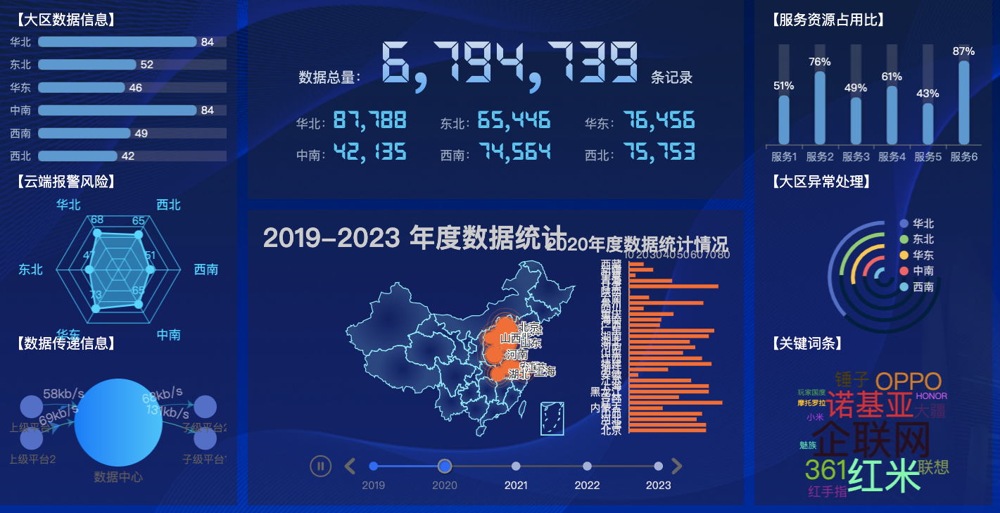

基于vite与tailwindcss创建大屏可视化
### 项目准备
传统的三列布局 
```js
<template>

<div class="w-full h-full">

<div v-if="loading" class="bg-[url('assets/images/bg.png')] bg-cover bg-center loading-container h-screen w-full flex justify-center items-center">

<div class="loading"></div>

</div>

<div

class="bg-[url('assets/images/bg.png')] bg-cover bg-center h-screen text-white p-3 flex overflow-hidden"

v-else

>

<!-- left -->

<div class="flex-1 mr-3 bg-opacity-50 bg-slate-800 p-3">

<!-- 横向柱状图 -->

<HorizontalBar class="h-1/3 box-border pb-2" :data="data.regionData" />

<!-- 雷达图 -->

<RadarBar class="h-1/3 box-border pb-2" :data="data.riskData" />

<!-- 关系图 -->

<Relation class="h-1/3" :data="data.relationData" />

</div>

<!-- center -->

<div class="w-1/2 mr-3 flex flex-col">

<!-- 数据总览图 -->

<TotalData

class="bg-opacity-50 bg-slate-800 p-3"

:data="data.totalData"

/>

<!-- 地图可视化 -->

<MapChart

class="bg-opacity-50 bg-slate-800 p-3 mt-3 flex-1"

:data="data.mapData"

/>

</div>

<!-- right -->

<div class="flex-1 bg-opacity-50 bg-slate-800 p-3 flex flex-col">

<!-- 竖向柱状图 -->

<VerticalBar class="h-1/3 box-border pb-2" :data="data.serverData" />

<!-- 环形图 -->

<RingBar class="h-1/3 box-border pb-2" :data="data.abnormalData" />

<!-- 文档云图 -->

<WordCloud class="h-1/3" :data="data.wordCloudData" />

</div>

</div>

</div>

</template>
<script setup>

import HorizontalBar from "@/components/HorizontalBar.vue";

import RadarBar from "@/components/RadarBar.vue";

import Relation from "@/components/Relation.vue";

import TotalData from "@/components/TotalData.vue";

import MapChart from "@/components/MapChart.vue";

import VerticalBar from "@/components/VerticalBar.vue";

import RingBar from "@/components/RingBar.vue";

import WordCloud from "@/components/WordCloud.vue";

  

import { reactive, ref } from "vue";

import { getVisualization } from "../../api/visualization";

import { useRouter } from "vue-router";

  

import { throttleTimeAndTimer } from "../../utils/utils";

  

// 本地mock数据

// import mockData from "./utils/mockData";

// let _mockData = reactive(mockData);

  

// 加载状态

const loading = ref(true);

  

const data = ref(null);

const loadData = async () => {

data.value = await getVisualization();

loading.value = false;

};

loadData();
setInterval(() => {

loadData();

}, 3000);
</script>
```
### 绘制大区横向柱形图
```js
<template>

<div>

<div>【大区数据信息】</div>

<div ref="target" class="w-full h-full"></div>

</div>

</template>

  

<script setup>

import { ref, onMounted, watch} from "vue";

import * as echarts from "echarts";

// 定义接收父组件传来的值

const props = defineProps({

data: {

type: Object,

required: true,

},

});

  

// 1.初始化

let myChart = null;

const target = ref(null);

onMounted(() => {

myChart = echarts.init(target.value);

renderChart();

});

  

// 2.构建 option 配置对象

const renderChart = () => {

const options = {

// X轴展示数据

xAxis: {

show: false, //不显示X

type: "value", //表示X轴作为数据展示

max: function (value) {

return parseInt(value.max * 1.2);

},

},

// Y轴展示数据

yAxis: {

type: "category",

data: props.data.regions.map((item) => item.name),

inverse: true,

axisLine: { show: false }, //不展示线

axisTick: { show: false }, //不展示刻度

axisLabel: { color: "#9eb1c8" },

},

// 图标绘制的位置 对应上下左右

grid: {

top: 0,

right: 0,

bottom: 0,

left: 0,

containLabel: true, //计算时包含标签

},

// 核心配置

series: [

{

type: "bar",

data: props.data.regions.map((item) => ({

name: item.name,

value: item.value,

})),

showBackground: true,

backgroundStyle: {

color: "rgba(180, 180, 180, 0.2)",

},

itemStyle: {

color: "#5D98CE",

barBorderRadius: 5,

shadowColor: "rgba(0,0,0,0.3)",

shadowBlur: 5,

},

barWidth: 12,

label: {

show: true,

position: "right",

textStyle: {

color: "#fff",

},

},

},

],

};

// 3.通过实例.setOptions(option)

myChart.setOption(options);

};

watch(

() => props.data,

() => renderChart()

);

</script>
```
### 绘制服务竖向柱形图
```js
 <template>

<div>

<div>【服务资源占用比】</div>

<div ref="target" class="w-full h-full"></div>

</div>

</template>

  

<script setup>

import { ref, onMounted, watch } from "vue";

import * as echarts from "echarts";

  

// 定义接收父组件传来的值

const props = defineProps({

data: {

type: Object,

required: true,

},

});

// 1.初始化

let myChart = null;

const target = ref(null);

onMounted(() => {

myChart = echarts.init(target.value);

renderChart();

});

  

// 2.构建 option 配置对象

const renderChart = () => {

const options = {

// X轴展示数据

xAxis: {

type: "category",

data: props.data.servers.map(item=>item.name),

axisLabel: { color: "#9eb1c8" },

},

// Y轴展示数据

yAxis: {

show: false, //不显示X

type: "value", //表示X轴作为数据展示

max: function (value) {

return parseInt(value.max * 1.2);

},

},

// 图标绘制的位置 对应上下左右

grid: {

top: 16,

right: 0,

bottom: 26,

left: -26,

containLabel: true, //计算时包含标签

},

// 核心配置

series: [

{

type: "bar",

data: props.data.servers.map(item => ({

name: item.name,

value:item.value

})),

showBackground: true,

backgroundStyle: {

color: 'rgba(180, 180, 180, 0.2)'

},

itemStyle: {

color: '#5D98CE',

barBorderRadius: 5,

shadowColor: 'rgba(0,0,0,0.3)',

shadowBlur: 5

},

barWidth: 12,

label: {

show: true,

position: 'top',

textStyle: {

color:'#fff',

},

formatter:'{c}%'

}

},

],

};

// 3.通过实例.setOptions(option)

myChart.setOption(options);

};

  

watch(() => props.data,renderChart)

</script> 
```


### 绘制报警风险雷达图
```js
  

<template>

<div>

<div>【云端报警风险】</div>

<div ref="target" class="w-full h-full"></div>

</div>

</template>

  

<script setup>

import { ref, onMounted,watch } from 'vue';

import * as echarts from "echarts";

// 定义接收父组件传来的值

const props = defineProps({

data: {

type: Object,

required: true,

},

});

// console.log(props.data);

// 1.初始化

let myChart = null;

const target = ref(null);

onMounted(() => {

myChart = echarts.init(target.value);

renderChart();

});

  

// 2.构建 option 配置对象

const renderChart = () => {

const options = {

// 雷达图坐标系配置

radar: {

name: {

textStyle: {

color: "#05D5FF",

fontSize: 14

}

},

shape: 'polygon',

center: ['50%', '50%'],

radius: '80%',

startAngle: 120,

// 轴线

axisLine: {

lineStyle: {

color: 'rgba(2,213,255,.8)'

}

},

// 网格线

splitLine: {

show: true,

lineStyle: {

with: 1,

color: 'rgba(5,213,255,.8)'

}

},

// 指示器名称

indicator: props.data.risks.map(item => ({

name: item.name,

max: 100

})),

splitArea: {

show:false

}

},

// 位置、极点

polar: {

center: ['50%', '50%'],

radius:'0%'

},

// 坐标角度

angleAxis: {

min: 0,

interval: 5,

clockwise:false,//刻度逆时针

},

// 径向轴

radiusAxis: {

min: 0,

interval: 20,

splitLine: {

show:true

}

},

// 图表核心配置

series: {

type: 'radar',

symbol: 'circle',

symbolSize: 10,

itemStyle: {

normal: {

color:'#05D5FF'

}

},

areaStyle: {

normal: {

color: '#05D5FF',

opacity:0.5

}

},

lineStyle: {

with: 2,

color:'#05D5FF'

},

label: {

normal: {

show:true,

color: '#05D5FF',

}

},

data: [

{

value:props.data.risks.map(item=>item.value)

}

]

}

}

// 3.通过实例.setOptions(option)

myChart.setOption(options);

};

watch(() => props.data,renderChart)

  

</script>
```
### 绘制异常处理双环形图
```js
<template>

<div>

<div>【大区异常处理】</div>

<div ref="target" class="w-full h-full"></div>

</div>

</template>

  

<script setup>

import { ref, onMounted,watch } from "vue";

import * as echarts from "echarts";

  

const props = defineProps({

data: {

type: Object,

required: true,

},

});

// console.log(props.data);

// 1.初始化

let myChart = null;

const target = ref(null);

onMounted(() => {

myChart = echarts.init(target.value);

renderChart();

});

  

const getSeriesData = () => {

const series = [];

props.data.abnormals.forEach((item, index) => {

// 上层

series.push({

name: item.name,

type: "pie",

clockWise: false,

hoverAnimation: false,

radius: [73 - index * 15 + "%", 68 - index * 15 + "%"],

center: ["55%", "55%"],

label: {

show: false,

},

data: [

{

value: item.value,

name: item.name,

},

{

value: 1000,

itemStyle: {

color: "rgba(0,0,0,0)",

borderWidth: 0,

},

tooltip: {

show: false,

},

hoverAnimation: false,

},

],

});

  

// 底层

series.push({

name: item.name,

type: "pie",

silent: true,

z: 1,

clockWise: false,

hoverAnimation: false,

radius: [73 - index * 15 + "%", 68 - index * 15 + "%"],

center: ["55%", "55%"],

label: {

show: false,

},

data: [

{

value: 7.5,

itemStyle: {

color: "rgb(3,31,62)",

borderWidth: 0,

},

tooltip: {

show: false,

},

hoverAnimation: false,

},

{

value: 2.5,

itemStyle: {

color: "rgba(0,0,0,0)",

borderWidth: 0,

},

tooltip: {

show: false,

},

hoverAnimation: false,

},

],

});

});

  

return series;

};

// 2.构建 option 配置对象

const renderChart = () => {

const options = {

// 图例配置

legend: {

show: true,

icon: "circle",

top: "14%",

left: "60%",

data: props.data.abnormals.map((item) => item.name),

width: -5,

itemWidth: 10,

itemHeight: 10,

itemGap: 6,

textStyle: {

fontSize: 12,

lineHeight: 5,

color: "rgba(255,255,255,.8)",

},

},

// 提示层

tooltip: {

show: true,

trigger: "item",

formatter: "{a}<br/>{b}:{c}({d}%)",

},

// Y

yAxis: [

{

type: "category",

inverse: true,

axisLine: {

show: false,

},

},

],

// X

xAxis: [

{

show: false,

},

],

// 核心

series: getSeriesData(),

};

// 3.通过实例.setOptions(option)

myChart.setOption(options);

};

watch(() => props.data,renderChart)

</script>

  

<style lang="scss" scoped></style>
```
### 绘制数据传递关系图
```js
  

<template>

<div>

<div>【数据传递信息】</div>

<div ref="target" class="w-full h-full"></div>

</div>

</template>

  

<script setup>

import { ref, onMounted,watch } from 'vue';

import * as echarts from "echarts";

// 定义接收父组件传来的值

const props = defineProps({

data: {

type: Object,

required: true,

},

});

// 1.初始化

let myChart = null;

const target = ref(null);

onMounted(() => {

myChart = echarts.init(target.value);

renderChart();

});

  

// console.log(props.data,"关系");

  

// 2.构建 option 配置对象

const renderChart = () => {

const options = {

xAxis: {

show: false,

type:'value'

},

yAxis: {

show: false,

type:'value'

},

series: [

//

{

type: 'graph',

layout: 'none',

coordinateSystem: 'cartesian2d',

symbolSize: 26,

z: 3,

edgeLabel: {

normal: {

show: true,

color: '#fff',

textStyle: {

fontSize:14

},

formatter: function (params) {

return params.data.speed

}

}

},

label: {

normal: {

show: true,

position: 'bottom',

color:'#5E5E5E'

}

},

edgeSymbol: ['none', 'arrow'],

edgeSymbolSize: 8,

data: props.data.relations.map(item => {

if (item.id !== 0) {

return {

name: item.name,

category: 0,

active: true,

speed: `${item.speed}kb/s`,

value:item.value

}

} else {

return {

name: item.name,

value: item.value,

symbolSize: 100,

itemStyle: {

normal: {

color: {

colorStops: [

{ offset: 0, color: '#157eff' },

{ offset: 1, color: '#35c2ff' },

]

}

}

},

label: {

fontSize:'14'

}

}

}

}),

// 极点

links: props.data.relations.map((item, index) => ({

source: item.source,

target: item.target,

speed: `${item.speed}kb/s`,

lineStyle: {

normal: {

color: '#12b5d0',

curveness:0.2

}

},

label: {

show: true,

position: 'middle',

offset:[10,0]

}

}))

},

{

type: 'lines',

coordinateSystem: 'cartesian2d',

z: 1,

effect: {

show: true,

amooth: false,

trailLength: 0,

symbol: 'arrow',

color: 'rgba(55,155,255,0.6)',

symbolSize:12

},

lineStyle: {

normal: {

curveness:0.2

}

},

data: [

[{coord:[0,300]},{coord:[50,200]}],

[{coord:[0,100]},{coord:[50,200]}],

[{coord:[50,200]},{coord:[100,100]}],

[{coord:[50,200]},{coord:[100,300]}],

]

}

]

}

// 3.通过实例.setOptions(option)

myChart.setOption(options);

};

  

watch(() => props.data,renderChart)

  

</script>

  

<style lang="scss" scoped>

  

</style>
```
### 绘制关键词条文档云图
```js
  

<template>

<div>

<div>【关键词条】</div>

<div ref="target" class="w-full h-full"></div>

</div>

</template>

  

<script setup>

import { ref, onMounted,watch } from 'vue';

import * as echarts from "echarts";

import 'echarts-wordcloud'

// 定义接收父组件传来的值

const props = defineProps({

data: {

type: Object,

required: true,

},

});

// 1.初始化

let myChart = null;

const target = ref(null);

onMounted(() => {

myChart = echarts.init(target.value);

renderChart();

});

  

// console.log(props.data, "云图");

  

const randowRGB = () => {

const r = Math.floor(Math.random() * 255)

const g = Math.floor(Math.random() * 255)

const b = Math.floor(Math.random() * 255)

  

return `rgb(${r},${g},${b})`

}

  

// 2.构建 option 配置对象

const renderChart = () => {

const options = {

series: [

{

type: 'wordCloud',

sizeRange: [8, 46],

rotationRange: [0, 0],

gridSize: 0,

layoutAnimation: true,

textStyle: {

color:randowRGB

},

emphasis: {

textStyle: {

fontWeight: 'bold',

color:'#ffffff'

}

},

data:props.data.datas

}

]

}

// 3.通过实例.setOptions(option)

myChart.setOption(options);

};

watch(() => props.data,renderChart)

</script>

  

<style lang="scss" scoped>

  

</style>
```

### 绘制数据总览图
style.css文件
```css
@tailwind base;

@tailwind components;

@tailwind utilities;

  

/* 引入外部字体 */

@font-face {

font-family: 'Electronic';

src: url('./assets/fonts/FX-LED.TTF');

}

  

/* 背景渐变+字体镂空 */

.text-gradient{

background-image: linear-gradient(to bottom,#e5e4ea,#5ea8f2);

-webkit-background-clip: text;

-webkit-text-fill-color: transparent;

}
```


```js
<template>

<div>

<div class=" p-6">

<!-- 总数据 -->

<div class=" text-slate-300 text-center">

数据总量：

<span ref="totalCountTarget" class="text-gradient font-[Electronic] text-7xl ml-2 mr-2 font-bold">

679,473,929

</span>

条记录

</div>

  

<!-- 其他数据 -->

<div class=" mt-3 flex flex-wrap">

<div class=" w-1/3 text-center text-slate-400 text-sm">

华北：<span ref="city1" class="font-[Electronic] text-[#5dc5ef] text-3xl">9,778,988</span>

</div>

<div class=" w-1/3 text-center text-slate-400 text-sm">

东北：<span ref="city2" class="font-[Electronic] text-[#5dc5ef] text-3xl">9,778,988</span>

</div>

<div class=" w-1/3 text-center text-slate-400 text-sm">

华东：<span ref="city3" class="font-[Electronic] text-[#5dc5ef] text-3xl">9,778,988</span>

</div>

<div class=" w-1/3 text-center text-slate-400 text-sm">

中南：<span ref="city4" class="font-[Electronic] text-[#5dc5ef] text-3xl">9,778,988</span>

</div>

<div class=" w-1/3 text-center text-slate-400 text-sm">

西南：<span ref="city5" class="font-[Electronic] text-[#5dc5ef] text-3xl">9,778,988</span>

</div>

<div class=" w-1/3 text-center text-slate-400 text-sm">

西北：<span ref="city6" class="font-[Electronic] text-[#5dc5ef] text-3xl">9,778,988</span>

</div>

  

</div>

</div>

</div>

</template>

  

<script setup>

import {CountUp} from 'countup.js'

import { ref ,onMounted} from 'vue'

const props = defineProps({

data: {

type: Object,

required:true

}

})

  

const totalCountTarget = ref(null)

const city1 = ref(null)

const city2 = ref(null)

const city3 = ref(null)

const city4 = ref(null)

const city5 = ref(null)

const city6 = ref(null)

  

onMounted(() => {

new CountUp(totalCountTarget.value,props.data.total).start()

new CountUp(city1.value,props.data.hb).start()

new CountUp(city2.value,props.data.db).start()

new CountUp(city3.value,props.data.hd).start()

new CountUp(city4.value,props.data.zn).start()

new CountUp(city5.value,props.data.xn).start()

new CountUp(city6.value,props.data.xb).start()

})

  

</script>

  

<style lang="scss" scoped>

  

</style>
```
### 地图可视化
```js
<template>

<div>

<div ref="target" class="w-full h-full"></div>

</div>

</template>

  

<script setup>

import { ref, onMounted } from "vue";

import * as echarts from "echarts";

import mapJson from "../assets/json/china.json";

// 定义接收父组件传来的值

const props = defineProps({

data: {

type: Object,

required: true,

},

});

// 1.初始化

let myChart = null;

const target = ref(null);

onMounted(() => {

// 注册地图

echarts.registerMap("china", mapJson);

myChart = echarts.init(target.value);

renderChart();

});

  

// 2.构建 option 配置对象

const renderChart = () => {

const options = {

// 时间线

timeline: {

data: props.data.voltageLevel,

axisType: "category",

autoPlay: true,

playInterval: 3000,

left: "10%",

right: "10%",

bottom: "0%",

width: "80%",

label: {

normal: {

textStyle: {

color: "#ddd",

},

},

emphasis: {

texteStyle: {

color: "#fff",

},

},

},

symbolSize: 10,

lineStyle: {

color: "#555",

},

checkpointStyle: {

borderColor: "#888",

borderWidth: 2,

},

controlStyle: {

showNextBtn: true,

showPrevBtn: true,

normal: {

color: "#666",

borderColor: "#666",

},

emphasis: {

color: "#aaa",

borderColor: "#aaa",

},

},

},

// 柱形图

baseOption: {

grid: {

right: "2%",

top: "15%",

bttom: "10%",

width: "20%",

},

// 地图配置

geo: {

show: true,

map: "china",

roam: true,

zoom: 0.8,

center: [113.83531246, 34.0267395887],

itemStyle: {

normal: {

borderColor: "rgba(147,235,248,1)",

borderWidth: 1,

areaColor: {

type: "radial",

x: 0.5,

y: 0.5,

r: 0.5,

colorStops: [//地图渐变色

{

offset: 0,

color: "rgba(147,235,248,0)",

},

{

offset: 1,

color: "rgba(147,235,248,.2)",

},

],

},

},

emphasis: {

areaColor: "#389BB7",

borderColor: 0,

},

},

},

},

options: [],

};

// 根据时间线绘制柱形图

props.data.voltageLevel.forEach((item, index) => {

options.options.push({

//backgroundColor: "#142037",

title: [

{

text: "2019-2023 年度数据统计",

left: "0%",

top: "0%",

textStyle: {

color: "#ccc",

fontSize: 30,

},

},

{

id: "statistic",

text: item + "年度数据统计情况",

right: "0%",

top: "4%",

textStyle: {

color: "#ccc",

fontSize: 20,

},

},

],

xAxis: {

type: "value",

scale: true,

position: "top",

splitLine: {

show: false,

},

axisLine: {

show: false,

},

axisTick: {

show: false,

},

axisLabel: {

margin: 2,

textStyle: {

color: "#aaa",

},

},

},

yAxis: {

type: "category",

axisLine: {

show: true,

lineStyle: {

color: "#ddd",

},

},

axisTick: {

show: false,

},

axisLabel: {

interval: 0,

textStyle: {

color: "#ddd",

},

},

data: props.data.categoryData[item].map((item) => item.name),

},

series: [

{

type: "bar",

zlevel: 1.5,

itemStyle: {

normal: {

color: props.data.colors[index],

},

},

data: props.data.categoryData[item].map((item) => item.value),

},

// 地图散点图

{

type: "effectScatter",

coordinateSystem: 'geo',

data: props.data.topData[item],

symbolSize: function (val) {

return val[2] / 4

},

showEffectOn: 'render',

rippleEffect: {

brushType:"stroke",//散点水波效果

},

label: {

normal: {

formatter: '{b}',

position: "right",

show:true

}

},

itemStyle: {

normal: {

color: props.data.colors[index],

shadowBlur: 5,

shadowColor:props.data.colors[index]

}

}

}

]

});

});

// 3.通过实例.setOptions(option)

myChart.setOption(options);

};

</script>

  

<style lang="scss" scoped></style>

```

### 最终效果

### 总结
那么到这里，咱们本章的主要内容就已经全部完成了。
在本文章中，我们首先利用vite+ tailwindcss构建了一个大屏可视化的项目。<br/>
然后通过echarts完成了大屏可视化的功能。在项目中，每一个图表都是一个单独的组件。<br/>
我们还有可以有其他组件库比如antv并且利用G2库实现可视化<br/> 
另外，在本文章的最后，我为大家推荐一个echarts的图标库isqqy。这里面包含了各种各样的echarts图表，如果大家在开发中需要定制一些特定的图表的话，那么可以参考下这个网站的图表配置哦


