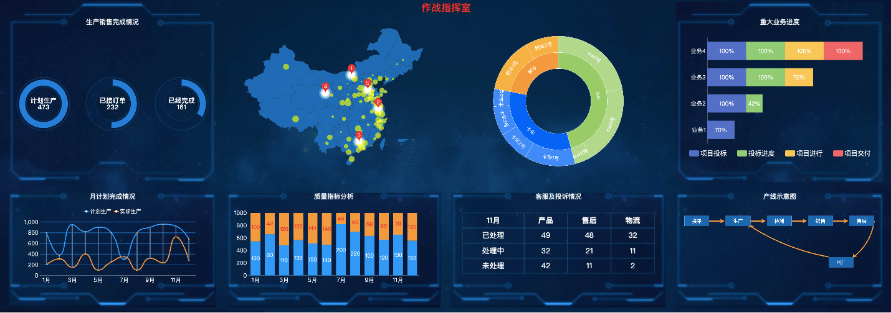

### 项目介绍
第二个大屏可视化，整个项目利用scale进行按比例适配。 图表更加复杂，涉及到图表的叠加，mark，地图，g6流程图的能等<br/>
始终保持比例适配(本项目方案),始终满屏适配(项目一).
echarts绘制较为复杂图表，更深入锻炼echarts.

### 按比例用scale适配思路
 1.开发项目直接使用设计图量出的尺寸填写大小
 2.页面打开，读取当前屏幕宽，高
 3.按当前屏幕宽高，通过scale缩放整个项目
 4.让项目高度，横向竖向始终居中

### 最终实现效果

### 使用vite搭建vue项目
然后在项目根目录下 index.html
```html
<body>

<div id="app"></div>
j
<script>

function setScale(){

const designWidth=4352;

const designHeight=1536;

const nowWidth=document.documentElement.clientWidth //window.screnn.width

const nowHeight=document.documentElement.clientHeight

const designRatio=designWidth/designHeight;

const nowRatio=nowWidth/nowHeight;

const app=document.getElementById("app");

//根据宽高比，决定按宽度进行scale还是高度进行scale

const scale=nowRatio<designRatio?nowWidth/designWidth:nowHeight/designHeight

app.style.transform=`scale(${scale}) translate(-50%,-50%)`

}

setScale();

window.addEventListener("resize",setScale)

</script>

<script type="module" src="/src/main.js"></script>

</body>
```
在assets静态目录下创建main.css 并在main.js中引入

```css
#app{

transform-origin: 0 0;

width: 4352px;

height: 1536px;

background: url('./backf.jpg');

background-size: 100% 100%;

/* 让他居中 */

position: fixed;

top:50%;

left:50%

}
```
### 整体布局和基本组件
```js
//App.vue
<script setup>

import { onMounted } from 'vue';

import produceChart from "@/components/chartComponent/produceChart.vue"

import monthPlanChart from "@/components/chartComponent/monthPlanChart.vue"

import mapChart from "@/components/chartComponent/mapChart.vue"

import qualityChart from "@/components/chartComponent/qualityChart.vue"

import carType from "@/components/chartComponent/carType.vue"

import complaintTable from "@/components/chartComponent/complaintTable.vue"

import majorChart from "@/components/chartComponent/majorChart.vue"

import g6chart from "@/components/chartComponent/g6chart.vue"

</script>

  

<template>

<div class="container">

<div class="title">

作战指挥室

</div>

<div class="column-one">

<produceChart></produceChart>

<monthPlanChart></monthPlanChart>

</div>

<div class="column-two">

<mapChart></mapChart>

<qualityChart></qualityChart>

</div>

<div class="column-three">

<carType></carType>

<complaintTable></complaintTable>

</div>

<div class="column-four">

<majorChart></majorChart>

<g6chart></g6chart>

</div>

</div>

</template>

  

<style scoped lang="less">

.container {

padding: 24px 55px;

width: 100%;

height: 100%;

box-sizing: border-box;

display: flex;

justify-content: space-between;

position: relative;

  

.title {

position: absolute;

left: 50%;

top: 20;

font-size: 48px;

color: red;

font-weight: 800;

transform: translateX(-50%);

}

  

.column-one,

.column-four,

.column-two,

.column-three {

display: flex;

flex-direction: column;

justify-content: space-between;

}

  

.column-one,

.column-four {

width: 1005px;

height: 100%;

  

}

  

.column-two,

.column-three {

width: 1036px;

height: 100%;

  

}

}

</style>
```
#### 将布局容器作为基础组件
```js
// src/components/baseComponent/bottomChartContent.vue
<script setup>

const { title } = defineProps(['title'])

  

</script>

  

<template>

<div class="bottomChartContent">

<div class="title"> {{ title }}</div>

<div class="soltContainer">

<slot></slot>

</div>

</div>

</template>

  

<style scoped lang="less">

.bottomChartContent {

width: 100%;

height: 558px;

background: url('../../assets/backpart2.png');

background-size: 100% 100%;

display: flex;

flex-direction: column;

  

.title {

font-size: 32px;

color: white;

width: 100%;

text-align: center;

}

  

.soltContainer {

width: 100%;

flex: 1

}

}

</style>
//components/baseComponent/topChartContent.vue
<script setup>

const { title } = defineProps(['title'])

  

</script>

  

<template>

<div class="topChartContainer">

<div class="title"> {{ title }}</div>

<div class="soltContainer">

<slot></slot>

</div>

</div>

</template>

  

<style scoped lang="less">

.topChartContainer {

width: 100%;

height: 878px;

background: url('../../assets/backpart1.png');

background-size: 100% 100%;

display: flex;

flex-direction: column;

  

.title {

font-size: 32px;

color: white;

width: 100%;

text-align: center;

padding-top: 78px;

}

  

.soltContainer {

width: 100%;

flex: 1

}

}

</style>
```
### 请求封装
```js
// request/index.js
import axios from "axios";

const request = axios.create({

timeout: 3000,

baseURL: import.meta.env.VITE_BASE_URL,

})

request.interceptors.request.use((config) => {

const token = localStorage.getItem("token");

if (token) {

config.auth = token;

}

return config

})

request.interceptors.response.use((res) => {

if (res.data.code !== 200) {

alert(res.data.msg || '请求失败')

}

return res;

}, () => {

alert("请求失败")

})

export default request
 // api/index.js
import request from "@/request";

export function getProduceStatus() {

return request("/produceStatus");

}

export function getPlanData() {

return request("/planData");

}

export function getMapData() {

return request("/mapData");

}

export function getQualityData() {

return request("/qualityData");

}

export function getCarSaleData() {

return request("/carSaleData");

}

export function getComplainData() {

return request("/complainData");

}

export function getMajorData() {

return request("/majorData");

}
```
### 几个echarts最基本的属性
```js
import * as echarts from 'echarts';

// 基于准备好的dom，初始化echarts实例 需要一个容器
var myChart = echarts.init(document.getElementById('main'));

// 绘制图表
myChart.setOption({
	//标题
  title: {
    text: 'ECharts 入门示例'
  },
  //图例，说明
  legend: {
    top: '5%',
    left: 'center'
  },
  //提示
	tooltip: {
    trigger: 'item'
  },
  //x轴数据
  xAxis: {
    data: ['衬衫', '羊毛衫', '雪纺衫', '裤子', '高跟鞋', '袜子']
  },
  //y轴数据
  yAxis: {},
  //内容
  series: [
    {
      name: '销量',
      type: 'bar',
      data: [5, 20, 36, 10, 10, 20]
    }
  ]
});
```

### 复杂的嵌套圆环图
```js
<script setup>

import topChartContent from '../baseComponent/topChartContent.vue';

import { getProduceStatus } from '@/api'

import { onMounted } from 'vue';

import * as echarts from "echarts"

const ringnameArr = ['计划生产', '已接订单', '已经完成']

function drawRing(data, dom, name) {

//已完成

const finish = data.finish;

//未完成就是总数处以完成

const unfinish = data.total - data.finish;

const opt = {

title: {

text: name + '\n' + data.finish,

left: 'center',

top: 'center',

textStyle: {

color: "white",

fontSize: 32

}

},

series: [

{

type: "pie",

left: 20,

right: 20,

radius: ['60%', '80%'],

label: {

show: false

},

data: [

{

value: finish,

itemStyle: {

color: "#017ed8"

}

}, {

value: unfinish,

itemStyle: {

color: "rgba(6,34,73,0.8)"

}

}]

},

{

name: "out",

type: "pie",

radius: ['75%', '78%'],

label: {

show: false,

},

data: [100],

itemStyle: {

color: "rgba(8,67,120,0.5)"

}

},

{

name: "out",

type: "pie",

radius: ['48%', '50%'],

label: {

show: false,

},

data: [100],

itemStyle: {

color: "rgba(8,67,120,0.5)"

}

}

]

}

const echartobj = echarts.init(dom);

echartobj.setOption(opt)

}

onMounted(() => {

getProduceStatus().then((res) => {

const data = res.data.data;

data.forEach((ringData, index) => {

drawRing(ringData, document.getElementById('ring' + index), ringnameArr[index])

})

})

})

</script>

  

<template>

<topChartContent title="生产销售完成情况">

<div class="produceChart">

<div class="ring" v-for="(item, index) in ringnameArr" :id="'ring' + index">

</div>

</div>

</topChartContent>

</template>

  

<style scoped lang="less">

.produceChart {

width: 100%;

height: 100%;

display: flex;

  

.ring {

flex: 1

}

}

</style>
```
### 复杂的折线图
```js
<script setup>

import bottomChartContent from '../baseComponent/bottomChartContent.vue';

import { getPlanData } from '@/api'

import { onMounted } from 'vue';

import * as echarts from "echarts"

import { axisBaseStyle } from '@/chartConfig.js'

const commonLineStyle = {

type: "line",

smooth: true,

lineStyle: {

width: 5

}

}

function drawLine(data, dom) {

const finishArr = [];

const targetArr = [];

const xAxisData = [];

const markLine = []

data.forEach((month) => {

xAxisData.push(month.month);

finishArr.push(month.finish);

targetArr.push(month.target);

markLine.push({

type: "line",

lineStyle: {

color: '#537598',

width: 5

},

data: [

[month.month, month.target],

[month.month, month.finish]

]

})

})

const opt = {

color: ["#2499f8", "#ff9900"],

tooltip: {

formatter(obj) {

const month = obj.data[0];

const dataitem = data.find((item) => {

if (item.month === month) {

return item;

}

})

let _target = dataitem.target;

let _finish = dataitem.finish;

let percent = (_finish / _target) * 100

return `${month} 完成率 ${percent.toFixed(0)}%`

},

textStyle: {

fontSize: 26

}

},

grid: {

top: "20%",

bottom: "30%",

left: '15%'

},

legend: {

top: '35px',

textStyle: {

color: "white",

fontSize: 26

}

},

yAxis: {

...axisBaseStyle,

splitLine: {

lineStyle: {

color: "#045597",

width: 4

}

}

},

xAxis: {

...axisBaseStyle,

type: "category",

data: xAxisData

},

series: [

{

...commonLineStyle,

name: "计划生产",

data: targetArr,

  

},

{

...commonLineStyle,

name: "实际生产",

data: finishArr,

},

...markLine

]

}

const echartobj = echarts.init(dom);

echartobj.setOption(opt)

}

onMounted(() => {

getPlanData().then((res) => {

drawLine(res.data.data, document.getElementById('monthPlan'))

})

})

</script>

  

<template>

<bottomChartContent title="月计划完成情况">

<div id="monthPlan"></div>

</bottomChartContent>

</template>

  

<style scoped lang="less">

#monthPlan {

width: 100%;

height: 100%;

}

</style>
```
### echart绘制地图效果
拿到数据。 搜索阿里云datav `https://datav.aliyun.com/portal/school/atlas/area_selector?spm=a2crr.23498931.0.0.176a15ddAwYvpV`点击可视化学院复制数据
```js
<script setup>

  

import { getMapData } from '@/api'

import { onMounted } from 'vue';

import * as echarts from "echarts"

import chinajson from "../../assets/china.json"

echarts.registerMap("china", chinajson)

function drawMap(data, dom) {

let _sortData = data.sort((pre, now) => {

return now.value - pre.value;

})

_sortData = _sortData.map((item) => {

return [

...item.position,

item.value,

item.name

]

})

const top5Arr = _sortData.splice(0, 5);

const top5Marker = top5Arr.map((item, index) => {

return {

name: item[3],

coord: [item[0], item[1]],

value: index

}

})

const opt = {

geo: {

top: "25%",

map: "china",

scaleLimit: {

min: 1.5,

max: 10

},

emphasis: {

itemStyle: {

areaColor: "#016bb5"

},

label: {

show: false

}

},

itemStyle: {

areaColor: "#016bb5"

},

roam: true,

},

series: [

{

type: "scatter",

coordinateSystem: "geo",

symbolSize: (dataItem) => {

const value = Number(dataItem[2]);

return value / 30;

},

itemStyle: {

color: 'rgba(255,255,0,0.8)',

},

data: _sortData

},

{

type: "effectScatter",

coordinateSystem: "geo",

markPoint: {

symbol: "pin",

itemStyle: {

color: "red"

},

symbolSize: 60,

label: {

fontSize: 26,

formatter(val) {

  

return val.data.value + 1;

}

},

data: top5Marker

},

symbolSize: 30,

itemStyle: {

color: 'white',

},

data: top5Arr

}

]

}

const echartobj = echarts.init(dom);

echartobj.setOption(opt)

}

onMounted(() => {

getMapData().then((res) => {

drawMap(res.data.data, document.getElementById("mapContent"))

})

})

</script>

  

<template>

<div id="mapContent">

  

</div>

</template>

  

<style scoped lang="less">

#mapContent {

width: 100%;

height: 878px;

padding-top: 88px;

box-sizing: border-box;

}

</style>

```
### echarts绘制等高堆叠柱状图
```js
<script setup>

import bottomChartContent from '../baseComponent/bottomChartContent.vue';

import { getQualityData } from '@/api'

import { onMounted } from 'vue';

import * as echarts from "echarts"

import { axisBaseStyle } from '@/chartConfig.js'

function drawBar(data, dom) {

const goodArr = [];

const badArr = []

const xAxisData = [];

data.forEach((item) => {

xAxisData.push(item.month);

const total = item.good + item.bad;

goodArr.push(item.good / total);

badArr.push(item.bad / total)

})

const opt = {

color: ["#2499f8", '#fe9901'],

grid: {

bottom: "30%"

},

xAxis: {

...axisBaseStyle,

type: "category",

data: xAxisData

},

yAxis: {

...axisBaseStyle,

splitLine: {

show: false

},

axisLabel: {

fontSize: 28,

color: "white",

formatter(val) {

return val * 1000

}

}

  

},

series: [

{

type: "bar",

stack: "total",

data: goodArr,

  

label: {

show: true,

color: "white",

fontSize: 26,

formatter(value) {

const originData = data.find((item) => {

if (item.month === value.name) {

return item;

}

})

return originData.good

}

}

},

{

type: 'bar',

stack: "total",

data: badArr,

label: {

show: true,

fontSize: 26,

color: "red",

formatter(value) {

const originData = data.find((item) => {

if (item.month === value.name) {

return item;

}

})

return originData.bad

}

}

}

]

}

const echartobj = echarts.init(dom);

echartobj.setOption(opt)

}

onMounted(() => {

getQualityData().then((res) => {

drawBar(res.data.data, document.getElementById('quality'))

})

})

</script>

  

<template>

<bottomChartContent title="质量指标分析">

<div id="quality"></div>

</bottomChartContent>

</template>

  

<style scoped lang="less">

#quality {

width: 100%;

height: 100%;

}

</style>
```
### echarts旭日图和表格
```js
<script setup>

import { getCarSaleData } from '@/api'

import { onMounted } from 'vue';

import * as echarts from "echarts"

import chinajson from "../../assets/china.json"

echarts.registerMap("china", chinajson)

function drawCarType(data, dom) {

let _data = [];

_data = data.map((item) => {

return {

name: item.carType,

value: item.value,

children: item.children

}

})

  

const opt = {

color: ['#ff9900', '#99cc66', '#0066ff'],

series: [

{

type: "sunburst",

radius: ['40%', '80%'],

label: {

rotate: 'tangential',

color: "white",

fontSize: 24

},

data: _data

}

]

}

const echartobj = echarts.init(dom);

echartobj.setOption(opt)

}

onMounted(() => {

getCarSaleData().then((res) => {

drawCarType(res.data.data, document.getElementById("carType"))

})

  

})

</script>

  

<template>

<div id="carType">

  

</div>

</template>

  

<style scoped lang="less">

#carType {

width: 100%;

height: 878px;

padding-top: 88px;

box-sizing: border-box;

}

</style>
```

### 横向进度图
```js
<script setup>

import topChartContent from '../baseComponent/topChartContent.vue';

import { getMajorData } from '@/api'

import { onMounted } from 'vue';

import * as echarts from "echarts"

import { axisBaseStyle } from '@/chartConfig.js'

function drawMajor(data, dom) {

const yAxisData = [];

const arr1 = [];

const arr2 = [];

const arr3 = [];

const arr4 = [];

const allArr = [arr1, arr2, arr3, arr4]

const nameArr = ['项目投标', '投标进度', '项目进行', '项目交付']

data.forEach((item) => {

const process = item.processState;

yAxisData.push(item.name);

process.forEach((processItem) => {

const category = {

"项目投标": (val) => {

arr1.push({

value: val,

label: {

show: val > 0

}

})

},

"投标进度": (val) => {

arr2.push({

value: val,

label: {

show: val > 0

}

})

},

"项目进行": (val) => {

arr3.push({

value: val,

label: {

show: val > 0

}

})

},

"项目交付": (val) => {

arr4.push({

value: val,

label: {

show: val > 0

}

})

}

}

  

category[processItem.stepName](processItem.finishPercent)

})

})

const opt = {

legend: {

bottom: 120,

textStyle: {

color: 'white',

fontSize: 32

},

itemHeight: 30,

itemWidth: 50,

itemGap: 50

},

grid: {

left: "15%",

bottom: '25%'

},

yAxis: {

...axisBaseStyle,

type: "category",

data: yAxisData

},

xAxis: {

splitLine: {

show: false

},

axisLabel: {

show: false

}

},

series: [

  

]

}

for (let i = 0; i < 4; i++) {

opt.series.push({

type: "bar",

name: nameArr[i],

label: {

show: true,

formatter(val) {

if (val.value !== 0) {

return val.value + "%"

}

},

fontSize: 28,

color: 'white'

},

stack: 'total',

data: allArr[i]

})

}

console.log(opt);

const echartobj = echarts.init(dom);

echartobj.setOption(opt)

}

onMounted(() => {

getMajorData().then((res) => {

drawMajor(res.data.data, document.getElementById("majorContainer"))

})

})

</script>

  

<template>

<topChartContent title="重大业务进度">

<div id="majorContainer">

  

</div>

</topChartContent>

</template>

  

<style scoped lang="less">

#majorContainer {

width: 100%;

height: 100%;

}

</style>
```
### g6关系图绘制
```js
<script setup>

import bottomChartContent from '../baseComponent/bottomChartContent.vue';

import { onMounted } from 'vue';

import g6 from "@antv/g6"

const baseNodeConfig = {

type: "rect",

labelCfg: {

style: {

fill: "white",

fontSize: 24

}

},

style: {

fill: '#1967af'

},

size: [120, 50]

}

const lineStyle = {

stroke: '#ff9900',

lineWidth: 5,

endArrow: {

path: g6.Arrow.vee(10, 10, 10),

d: 10

}

}

onMounted(() => {

const data = {

nodes: [

{

...baseNodeConfig,

x: 100,

y: 100,

type: "rect",

id: "接单",

label: "接单"

},

{

...baseNodeConfig,

x: 300,

y: 100,

type: "rect",

id: '生产',

label: "生产",

  

anchorPoints: [

[1, 0.5],

[1, 1],

[0, 0.5]

],

},

{

...baseNodeConfig,

x: 500,

y: 100,

type: "rect",

id: '检测',

label: "检测"

},

{

...baseNodeConfig,

x: 700,

y: 100,

type: "rect",

id: '销售',

label: "销售"

},

{

...baseNodeConfig,

x: 900,

y: 100,

type: "rect",

id: '售后',

label: "售后",

anchorPoints: [

[0, 0.5],

[1, 0.5]

],

},

{

...baseNodeConfig,

x: 800,

y: 300,

type: "rect",

anchorPoints: [

[1, 0],

[0, 0]

],

id: '回厂',

label: "回厂"

},

],

edges: [

{

source: "接单",

target: '生产',

style: {

...lineStyle

}

},

{

source: "生产",

target: '检测',

style: {

...lineStyle

}

},

{

source: "检测",

target: '销售',

style: {

...lineStyle

}

},

{

source: "销售",

target: '售后',

style: {

...lineStyle

}

},

{

source: "售后",

target: '回厂',

  

sourceAnchor: 1,

targetAnchor: 0,

type: "arc",

style: {

...lineStyle,

endArrow: {

path: g6.Arrow.vee(10, -10, 2)

}

}

},

{

source: "回厂",

target: '生产',

sourceAnchor: 1,

targetAnchor: 1,

type: "arc",

style: {

...lineStyle,

endArrow: {

path: g6.Arrow.vee(10, -4, 2)

}

}

}

]

}

const graph = new g6.Graph({

container: 'g6container'

})

graph.data(data);

graph.render();

})

</script>

  

<template>

<bottomChartContent title="产线示意图">

<div id="g6container"></div>

</bottomChartContent>

</template>

  

<style scoped lang="less">

#g6container {

width: 100%;

height: 100%;

}

</style>
```

> 如果对你有所帮助 就点个关注吧

本篇文章是`https://www.bilibili.com/video/BV1PE421w7iJ/?p=7&spm_id_from=pageDriver&vd_source=e73709c9a1618b4c6dfd58c6c40d8986`的笔记