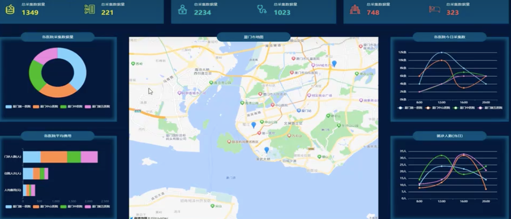

### **项目设计**


**1.始终满屏适配，这种方案一般用在屏幕变化不会特别的大项目，项目基本上不会用在比例非常不协调的大屏，设计图按1920*1080标准电脑屏幕比，所用的屏幕也基本在这个比例左右**
**2.涉及图表知识点简单，主要有自定义色系，环形图，堆叠柱状图，折线图**
**3.使用高德地图标点做中间地图**
### **满屏适配方案实现思路**
**1 宽度使用vw，高度使用vh，严格按照设计图换算，并且留出缓冲空间**
**2 具体算法，设计图为1920*1080<br/>**
		 **高度上：**
		 **1.设计图上量取高度**
		 **2.高度除以设计图高度1080**
		 **3得到结果*100**
		 **4计算结果加上vh单位3**
		 **宽度上：**
		 **设计图上量取宽度**
		 **高度除以设计图高度1920**
		 **得到结果*100**
		 **计算结果加上vw单位**
		 
**3 特别提醒，因为我们大屏项目，高度要始终保持一屏，一般移动端项目高度不用一屏，是可以滚动的，所以高宽统一VW**
### **项目头部制作**
```js
//
<template>
<div class="headerContainer">

<div class="header-title">大数据展示</div>

</div>

</template>
<script setup>
</script>

<style scoped>

.headerContainer{

width:100vw;

height:6.85vh;

background-color: #030829;

.header-title{

color:white;

font-size: 1.01vw;

width:28.48vh;

height:100%;

line-height:6.85vh;

text-align:center;

margin: 0 auto;

background-image: url("../assets/logoBg.png");

background-size: 100% 100%;

}

}

</style>
```
### **项目请求和环境搭建**
```js
// request/index.js
import axios from 'axios'

const request = axios.create({

timeout:10000,

baseURL:import.meta.env.VITE_BASE_URL

})

request.interceptors.request.use((config) => {

return config

})

request.interceptors.response.use((res) => {

if(res.data.code !== 200){

alert("请求错误")

}

return res

},(res) => {

alert("请求错误")

throw new Error(res)

})

export default request
// api/index.js
import request from '../request/index.js'
  

export function getGather(){

return request.get("/getGather")

}

export function getChargeData(){

return request.get("/getCharGeData")

}

export function getOutpatient(){

return request.get("/getOutpatient")

}

export function hosiptalPostion(){

return request.get("/hosiptalPostion")

}

export function getHospitalization(){

return request.get("/getHospitalization")

}

```

**在根目录创建.env.development和.env.production**
```
VITE_BASE_URL="http://localhost:8000"

```
**在App.vue**
```js
const loading = ref(true);
async function getAllData() {

//获取收费数据

const chargeRes = await getChargeData();

//获取采集数

const gatherRes = await getGather()

//获取门诊数据

const hospitalizationRes = await getHospitalization();

//获取住院数据

const outpatientRes = await getOutpatient();

//获取医院位置

loading.value = false;

return {

chargeRes: chargeRes.data.data,

gatherRes: gatherRes.data.data,

hospitalizationRes: hospitalizationRes.data.data,

outpatientRes: outpatientRes.data.data

}

}
```
### **顶部项目总览菜单**
```js
// components/showData.vue
<script setup>

const baseInfo = [

{

totalTitle: "总采集数据量",

monthTitle: "当月采集量",

totalIcon: "./info_1.png",

monthIcon: "./info_2.png",

color: "#ffff43"

},

{

totalTitle: "总门诊数量",

monthTitle: "当月门诊数量",

totalIcon: "./info_3.png",

monthIcon: "./info_4.png",

color: "#25ebca"

},

{

totalTitle: "总住院人数",

monthTitle: "当月住院人数",

totalIcon: "./info_5.png",

monthIcon: "./info_6.png",

color: "#ff4e4e"

}

]

const props = defineProps(['data'])

  

//第一次渲染->请求还没回来->页面渲染要先渲染出来

</script>

  

<template>

<div class="showdataContainer">

<div class="showdataBox" v-for="(item, index) in baseInfo">

<div class="part">

<div class="imgcontent">


</div>

<div class="valuecontent">

<div class="valuetitle">{{ item.totalTitle }}</div>

<div class="value" :style="{

color: item.color

}">

{{ props.data[index]?.total }}

</div>

</div>

</div>

<div class="part">

<div class="imgcontent">


</div>

<div class="valuecontent">

<div class="valuetitle">{{ item.monthTitle }}</div>

<div class="value" :style="{

color: item.color

}">

{{ props.data[index]?.month }}

</div>

</div>

</div>

</div>

</div>

</template>

  

<style scoped lang="scss">

.showdataContainer {

display: flex;

width: 100%;

justify-content: space-between;

  

.showdataBox {

width: 31.66vw;

height: 11.48vh;

background-color: #034c6a;

display: flex;

align-items: center;

padding-left: 1.3vw;

box-sizing: border-box;

  

.part {

width: 50%;

display: flex;

  

.imgcontent {

width: 2.08vw;

margin-right: 1.3vw;

  

img {

width: 100%

}

}

  

.valuecontent {

.valuetitle {

font-size: 0.75vw;

color: white;

}

  

.value {

margin-top: 1.38vh;

font-size: 1vw;

font-weight: 800;

}

}

}

}

}

</style>
//App.vue
async function getAllData() {

//获取收费数据

const chargeRes = await getChargeData();

//获取采集数

const gatherRes = await getGather()

//获取门诊数据

const hospitalizationRes = await getHospitalization();

//获取住院数据

const outpatientRes = await getOutpatient();

//获取医院位置

  

loading.value = false;

return {

chargeRes: chargeRes.data.data,

gatherRes: gatherRes.data.data,

hospitalizationRes: hospitalizationRes.data.data,

outpatientRes: outpatientRes.data.data

}

}
getAllData().then((res) => {

//进行数据赋值

//形成上面数据概览所需要数据

dataofshowData.push(

{

total: res.gatherRes.allgather,

month: res.gatherRes.monthegather

},

{

total: res.hospitalizationRes.allHospitalization,

month: res.hospitalizationRes.montHospitalization

},

{

total: res.outpatientRes.allOutpatient,

month: res.outpatientRes.monthOutpatient

},

)})
<script>
<template>

<div class="container">

<div v-if="!loading">

<topHeader></topHeader>

<div class="mainbody">

<showData :data="dataofshowData"></showData>

  

</div>

</div>

<div v-else>数据加载中请稍等</div>

</div>

</template>
```
### **主体布局设计**
```js
//App.vue
<template>

<div class="container">

<div v-if="!loading">

<topHeader></topHeader>

<div class="mainbody">

<showData :data="dataofshowData"></showData>

<div class="chartContainer">

<div class="leftOrRight">

<chartGather :data="chart1Data"></chartGather>

<chartCharge :data="chart2Data"></chartCharge>

</div>

<div class="middle">

<chartMap></chartMap>

</div>

<div class="leftOrRight">

<chartGatherToday :data="chart3Data"></chartGatherToday>

<chartHospitalizationToday :data="chart4Data"></chartHospitalizationToday>

</div>

</div>

  
  

</div>

</div>

<div v-else>数据加载中请稍等</div>

</div>

</template>

  

<style scoped lang="less">

.container {

width: 100vw;

height: 100vh;

background-color: #081832;

  

.mainbody {

width: 100vw;

box-sizing: border-box;

padding: 1.85vh 1.04vw;

  

.chartContainer {

padding-top: 5.09vh;

display: flex;

justify-content: space-between;

  

.leftOrRight {

display: flex;

flex-direction: column;

justify-content: space-between;

}

}

}

}

</style>
<script>
//引入四个组件
import chartGather from "./components/chartGather.vue";

import chartCharge from "./components/chartCharge.vue";

import chartGatherToday from "./components/chartGatherToday.vue";

import chartHospitalizationToday from "./components/chartHospitalizationToday.vue";
</script>
```
**chartContent.vue组件 布局组件**
```js
//component/chartContent.vue
<script setup>

const { title } = defineProps(['title'])

</script>

<template>

<div class="chartContentWrapper">

<div class="chartContentTitle">

{{ title }}

</div>

<div class="chartContentMain">

<slot></slot>

</div>

</div>

</template>

  

<style scoped lang="less">

.chartContentWrapper {

box-shadow: -10px 0px 15px #034c6a inset,

0px -10px 15px #034c6a inset,

10px 0px 15px #034c6a inset,

0px 10px 15px #034c6a inset;

position: relative;

  

.chartContentTitle {

width: 14.15vw;

height: 3.7vh;

background-color: #034c6a;

border-radius: 50px;

text-align: center;

color: white;

position: absolute;

left: 50%;

margin-left: -7.075vw;

top: -1.85vh;

line-height: 3.7vh;

z-index: 9999

}

}

</style>
```


**四个组件都布好局**
```js
//四个组件都是这样的布局  然后title字符串换换内容
<template>

<div>

<chartContent title="各医院今日采集量">

<div id="chart3Container" :style="{

width: '22.7vw',

height: '33.19vh'

}">

  

</div>

</chartContent>

</div>

</template>
```

	**![[Pasted image 20240803193402.png]]**
### **堆叠柱状图和圆环图**
```js
// component/chartGather.vue
<script setup>

import chartContent from './chartContent.vue';

import * as echarts from "echarts"

import { watch } from 'vue';

  

//引入echarts -》准备一个容器-》获取这个容器的真实dom-》init方法初始化图表-》setOptions给入配置绘制具体图表

const props = defineProps(['data']);

watch(props, () => {

if (props.data.length > 0) {

const _dom = document.getElementById("gatherChartContainer")

//以dom的大小为图表大小

const echartobj = echarts.init(_dom);

const opts = {

color: [

'#87cefa',

'#ff7f50',

'#32cd32',

'#da70d6'

],

legend: {

bottom: 25,

textStyle: {

color: "#fff"

}

},

series: [

{

type: "pie",

radius: ['40%', '70%'],

bottom: 30,

data: props.data,

label: {

show: false

}

}

]

}

echartobj.setOption(opts)

}

  

})

  

</script>

  

<template>

<div>

<chartContent title="各医院采集数据量">

<div id="gatherChartContainer" :style="{

width: '22.7vw',

height: '33.19vh'

}">

  

</div>

</chartContent>

</div>

</template>

  

<style scoped lang="less"></style>
//component/chartCharge.vue
<script setup>

import chartContent from './chartContent.vue';

import * as echarts from "echarts"

import { watch } from 'vue';

  

//引入echarts -》准备一个容器-》获取这个容器的真实dom-》init方法初始化图表-》setOptions给入配置绘制具体图表

const props = defineProps(['data']);

watch(props, () => {

if (props.data.length > 0) {

const _dom = document.getElementById("chargeChartContainer")

const echartobj = echarts.init(_dom);

const opts = {

grid: {

left: "20%",

bottom: "25%"

},

tooltip: {

  

},

legend: {

bottom: 35,

textStyle: {

color: "white"

}

},

color: [

'#87cefa',

'#ff7f50',

'#32cd32',

'#da70d6'

],

yAxis: {

type: "category",

axisLabel: {

color: "white"

},

data: ['人均费用(元)', '住院人次(人)', '门诊人数(人)']

},

xAxis: {

  

splitLine: {

show: false

},

type: 'value'

},

series: [

  

]

}

props.data.forEach((item) => {

opts.series.push({

type: "bar",

stack: "total",

name: item.name,

data: item.data

})

})

echartobj.setOption(opts)

}

  

})

  

</script>

  

<template>

<div>

<chartContent title="各医院平均费用">

<div id="chargeChartContainer" :style="{

width: '22.7vw',

height: '33.19vh'

}">

  

</div>

</chartContent>

</div>

</template>

  

<style scoped lang="less"></style>
```
### **折线图与坐标轴自定义**
```js
// chartGatherToday.vue
<script setup>

import chartContent from './chartContent.vue';

import * as echarts from "echarts"

import { watch } from 'vue';

  

//引入echarts -》准备一个容器-》获取这个容器的真实dom-》init方法初始化图表-》setOptions给入配置绘制具体图表

const props = defineProps(['data']);

//data-[{name:'xxx',data:[1,2,3]}]

watch(props, () => {

if (props.data.length > 0) {

const _dom = document.getElementById("chart3Container")

const echartobj = echarts.init(_dom);

const opts = {

grid: {

bottom: '25%',

left: '15%'

},

tooltip: {

  

},

legend: {

bottom: 35,

textStyle: {

color: "white"

}

},

color: [

'#87cefa',

'#ff7f50',

'#32cd32',

'#da70d6'

],

yAxis: {

axisLabel: {

color: "white",

formatter: (value) => {

return value + 'k条'

}

},

},

xAxis: {

axisLabel: {

color: "white"

},

type: "category",

data: [

"8:00",

"12:00",

"16:00",

"20:00"

]

},

series: [

  

]

}

props.data.forEach((item) => {

opts.series.push({

type: "line",

smooth: true,

name: item.name,

data: item.data

})

})

console.log(opts);

echartobj.setOption(opts)

}

})

</script>

  

<template>

<div>

<chartContent title="各医院今日采集量">

<div id="chart3Container" :style="{

width: '22.7vw',

height: '33.19vh'

}">

  

</div>

</chartContent>

</div>

</template>

  

<style scoped lang="less"></style>
//chartHospitalizationToday.vue
<script setup>

import chartContent from './chartContent.vue';

import * as echarts from "echarts"

import { watch } from 'vue';

  

//引入echarts -》准备一个容器-》获取这个容器的真实dom-》init方法初始化图表-》setOptions给入配置绘制具体图表

const props = defineProps(['data']);

//data-[{name:'xxx',data:[1,2,3]}]

watch(props, () => {

if (props.data.length > 0) {

const _dom = document.getElementById("chart4Container")

const echartobj = echarts.init(_dom);

const opts = {

grid: {

bottom: '25%',

left: '15%'

},

tooltip: {

  

},

legend: {

bottom: 35,

textStyle: {

color: "white"

}

},

color: [

'#87cefa',

'#ff7f50',

'#32cd32',

'#da70d6'

],

yAxis: {

axisLabel: {

color: "white",

formatter: (value) => {

return value + '人'

}

},

},

xAxis: {

axisLabel: {

color: "white"

},

type: "category",

data: [

"8:00",

"12:00",

"16:00",

"20:00"

]

},

series: [

  

]

}

props.data.forEach((item) => {

opts.series.push({

type: "line",

smooth: true,

name: item.name,

data: item.data

})

})

console.log(opts);

echartobj.setOption(opts)

}

  

})

</script>

  

<template>

<div>

<chartContent title="就诊人数(今日)">

<div id="chart4Container" :style="{

width: '22.7vw',

height: '33.19vh'

}">

  

</div>

</chartContent>

</div>

</template>

  
<style scoped lang="less"></style>
```
### **地图开发和标记点**
**搜索高德开放平台。注册账号并打开网站`https://lbs.amap.com/api/javascript-api-v2/summary`根据里面文档看代码**
```html
//项目的根目录index.html文件
<!DOCTYPE html>

<html lang="en">

<head>

<meta charset="UTF-8">

<link rel="icon" href="/favicon.ico">

<meta name="viewport" content="width=device-width, initial-scale=1.0">

<title>Vite App</title>

</head>

<body>

<script type="text/javascript">

window._AMapSecurityConfig = {

securityJsCode: "你的密钥",

};

</script>

<script src="https://webapi.amap.com/loader.js"></script>

<div id="app"></div>

<script type="module" src="/src/main.js"></script>

</body>

</html>
```
**<br/>**
```js
<script setup>

import chartContent from './chartContent.vue';

import { hosiptalPostion } from '@/api';

import { onMounted } from 'vue';

import config from "@/global.config.js"

function createInfoWindow(AMap, mapObj, info) {

console.log(info);

let infoWindow = new AMap.InfoWindow({

isCustom: true,

content: `<div class="window-container">

${info.name}

</div>`

})

//第一个参数在哪个地图打开，第二参数打开的位置,info.postion

infoWindow.open(mapObj, info.position)

}

//标记点

function creatPoint(AMap, mapObj, data) {

const marker = new AMap.Marker({

position: new AMap.LngLat(data.position[0], data.position[1]),

})

marker.on("click", (e) => {

createInfoWindow(AMap, mapObj, {

name: data.hospitalName,

position: e.target.getPosition()

})

})

mapObj.add(marker);

}

  

onMounted(() => {

hosiptalPostion().then((res) => {

const _data = res.data.data

//拿到数据进行绘制，AMapLoader，是引入高德地图后自动注入到window

AMapLoader.load({

key: config.amapkey, //申请好的Web端开发者 Key，调用 load 时必填

version: "2.0", //指定要加载的 JS API 的版本，缺省时默认为 1.4.15

})

.then((AMap) => {

const map = new AMap.Map("map1", {

zoom: 13,

center: _data[0].position

})

_data.forEach((item) => {

creatPoint(AMap, map, item)

})

})

.catch((e) => {

  

});

});

})

</script>

  

<template>

<div>

<chartContent title="厦门市地图">

<div id="map1" :style="{

width: '47.83vw',

height: '72vh'

}">

  

</div>

</chartContent>

</div>

</template>

  

<style>

.window-container {

width: 100px;

height: 50px;

text-align: center;

background-color: white;

}

</style>

```
**最终实现效果**
**![[Pasted image 20240804080830.png]]**

>**如果对你有所帮助的话 点个关注吧**

**这篇文章是这个视频的笔记`https://www.bilibili.com/video/BV1Hy411B79x/?spm_id_from=333.788&vd_source=e73709c9a1618b4c6dfd58c6c40d8986`**